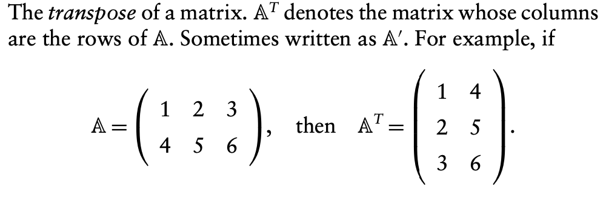
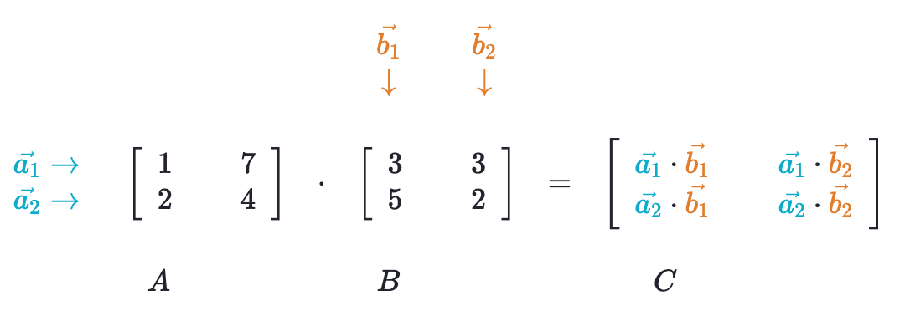
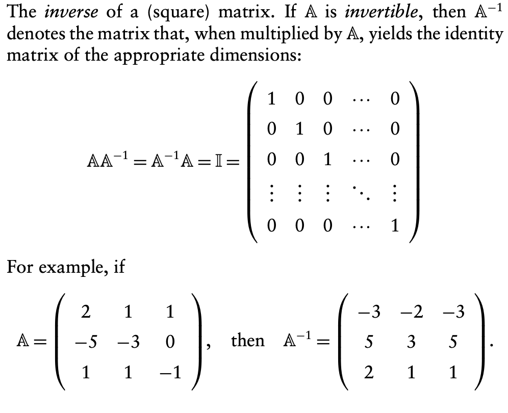

```{r setup, include=FALSE}
library(tidyverse)
library(gridExtra)
library(estimatr)
library(knitr)
# library(broom)
set.seed(60637)
options(width = 60)
library(pander)
options(digits = 2)
options(round = 2)
options(scipen = 999)

```

```{css, echo=FALSE}
.small-output .remark-code{
  font-size: small;
}

.white { color: white; }
.red { color: red; }
.blue { color: blue; }


```

# Housekeeping

- final projects/exam


---
class: inverse, middle, center

# Inference for linear models


---

# CEF 
#### [review from last week]

We're interested in the conditional expectation function. 

 - Conditional expectation $E[Y | X = x]$ is for a specific $x$.

 - Conditional expectation function (CEF) $E[Y | X]$ is for all $x$.

---

# Best *linear* predictor (BLP) 
#### [review from last week]

Say we focus on a linear predictor, i.e. a function of the form $\alpha + \beta X$.

--

The best (minimum MSE) predictor satisfies

$$(\alpha, \beta) = \underset{(a,b) \in \mathbb{R}^2}{\arg\min} \, \mathrm{E}\,[\left(Y - (a + bX)\right)^2]$$
--

The solution (see Theorem 2.2.21) is 

- $\beta = \frac{\textrm{Cov}[X, Y]}{\textrm{V}[X]}$
- $\alpha = \textrm{E}[Y] - \beta \textrm{E}[X]$ 

--

So we could obtain the BLP from a joint PMF. (See homework 7.)

---
We have already seen that if we don't include any explanatory variables in our model, we just get the sample mean of $Y$ (Theorem 2.1.25, Expected Value Minimizes MSE). 


--


In this case, estimating standard errors and confidence intervals follows the same procedures as for sample means. 


---

We can think about parameters in a linear model in a similar way. 

$$
\textrm{E}[Y| X] = \alpha + {\beta}_1 X
$$ 

--

The true population parameters are generally unknown. 

---

We estimate them for a given sample. 

$$ \hat{Y}_i = \hat{\alpha} +  \hat{\beta}_1 X_i $$ 

--

We will think about our random sample being not just for one variable, but from the joint distribution of $(Y, X)$. 

--

Then each $\hat{\beta}_k$ is also random, with its own sampling distribution. 

--

We can get a point estimate for each of the parameters, $\hat{\beta}_k$: the coefficients in our linear model. 

--

We also want to get an estimate of the standard errors of the estimates, $\sqrt{\hat{\textrm{Var}}[\hat{\beta}_k]}$. 


---
Some data:

 - $X \sim U(0,1)$
 - True intercept of BLP is 0
 - True slope of BLP is 2
 - Sample is 100

```{r}

cef_alpha <- 0
cef_slope <- 2
n <- 100
dat <- tibble(x = runif(n)) |> 
  mutate(y = rnorm(n, mean = cef_alpha + cef_slope*x, sd = .5))

```


---

Our data:

```{r, fig.width = 6, fig.height=6, fig.align = 'center', echo=FALSE}

the_lm <- lm(y ~ x, data = dat)

gg <- dat |> 
  ggplot(aes(x = x, y = y)) + 
  coord_cartesian(xlim = c(0,1), ylim = c(-1, 2.75))

gg + 
  geom_point(alpha = 0.5) + 
  geom_abline(slope = cef_slope, intercept = cef_alpha, col = "red", lwd = 1) + 
  geom_text(data = data.frame(x = .9, y = 1.7, label = "CEF"), aes(x = x , y = y , label = label), col = "red")

```


---

Our data:

```{r, fig.width = 6, fig.height=6, fig.align = 'center', echo=FALSE}

gg + 
  geom_point(alpha = 0.5) + 
  geom_abline(slope = cef_slope, intercept = cef_alpha, col = "red", lwd = 1) + 
  geom_text(data = data.frame(x = .9, y = 1.7, label = "CEF"), aes(x = x , y = y , label = label), col = "red") + 
  geom_abline(slope = coef(the_lm)[2], intercept = coef(the_lm)[1], col = "blue", lwd = 1) + 
  geom_text(data = data.frame(x = .9, 
                              y = .1 + predict(the_lm, newdata = data.frame(x = .9)), 
                              label = "OLS"),
            aes(x = x , y = y , label = label), col = "blue")


```

---

For one sample from the distribution, we get the following intercept and slope:

```{r}
lm(y ~ x, data = dat)
```


---
Our data:

```{r, fig.width = 6, fig.height=6, fig.align = 'center', echo=FALSE}

gg + 
  geom_point(alpha = 0.5) + 
  geom_abline(slope = cef_slope, intercept = cef_alpha, col = "red", lwd = 1, alpha = 0.25) + 
  # geom_text(data = data.frame(x = .9, y = 1.7, label = "CEF"), aes(x = x , y = y , label = label), col = "red") + 
  geom_abline(slope = coef(the_lm)[2], intercept = coef(the_lm)[1], col = "blue", lwd = 1) + 
  # geom_text(data = data.frame(x = .9, 
  #                             y = .1 + predict(the_lm, newdata = data.frame(x = .9)), 
  #                             label = "OLS"),
  #           aes(x = x , y = y , label = label), col = "blue", alpha = 0.25) +
  geom_hline(yintercept = coef(the_lm)[1], col = 'blue', lty = 'longdash') + 
  geom_segment(aes(x = 0, xend = 0, y = coef(the_lm)[1], yend = coef(the_lm)[1] + coef(the_lm)[2]*.5) ,
               col = 'blue', lty = 'dashed', 
               arrow = arrow(length = unit(0.03, "npc"), type = 'closed')) + 
  geom_segment(aes(x = 0, xend = 0.5, y = coef(the_lm)[1] + coef(the_lm)[2]*.5, yend = coef(the_lm)[1] + coef(the_lm)[2]*.5),
               col = 'blue', lty = 'dashed',
               arrow = arrow(length = unit(0.03, "npc"), type = 'closed')) +
  geom_text(data = data.frame(x = 0.5, y = -.25, label = 'Intercept'),
            aes(x = x , y = y , label = label), color = 'blue') +
  geom_text(data = data.frame(x = 0.25, y = 1.2, label = 'Slope'),
            aes(x = x , y = y , label = label), color = 'blue')

coef(the_lm)
```


---


We could re-sample, and get a different slope and intercept:

```{r, fig.width = 6, fig.height=6, fig.align = 'center', echo=FALSE}

dat <- tibble(x = runif(n)) |> 
  mutate(y = rnorm(n, mean = cef_alpha + cef_slope*x, sd = .5))

gg <- dat |> 
  ggplot(aes(x = x, y = y)) + 
  coord_cartesian(xlim = c(0,1), ylim = c(-1, 2.75))

lm0 <- lm(y ~ x, data = dat)

gg + 
  geom_point(alpha = 0.5) + 
  geom_abline(slope = cef_slope, intercept = cef_alpha, col = "red", lwd = 1,
              alpha = 0.25) + 
  geom_abline(slope = coef(the_lm)[2], intercept = coef(the_lm)[1], col = "blue", lwd = 1,
              alpha = 0.25) + 
  geom_abline(slope = coef(lm0)[2], intercept = coef(lm0)[1], col = "blue", lwd = 1)

coef(lm0)

```


---

We could re-sample, and get a different slope and intercept:

```{r, fig.width = 6, fig.height=6, fig.align = 'center', echo=FALSE}

dat <- tibble(x = runif(n)) |> 
  mutate(y = rnorm(n, mean = cef_alpha + cef_slope*x, sd = .5))

gg <- dat |> 
  ggplot(aes(x = x, y = y)) + 
  coord_cartesian(xlim = c(0,1), ylim = c(-1, 2.75))

lm1 <- lm(y ~ x, data = dat)

gg + 
  geom_point(alpha = 0.5) + 
  geom_abline(slope = cef_slope, intercept = cef_alpha, col = "red", lwd = 1,
              alpha = 0.25) + 
  geom_abline(slope = coef(the_lm)[2], intercept = coef(the_lm)[1], col = "blue", lwd = 1,
              alpha = 0.25) + 
  geom_abline(slope = coef(lm0)[2], intercept = coef(lm0)[1], col = "blue", lwd = 1,
              alpha = 0.25) + 
  geom_abline(slope = coef(lm1)[2], intercept = coef(lm1)[1], col = "blue", lwd = 1)

coef(lm1)

```


---
We could re-sample, and get a different slope and intercept:

```{r, fig.width = 6, fig.height=6, fig.align = 'center', echo=FALSE}

dat <- tibble(x = runif(n)) |> 
  mutate(y = rnorm(n, mean = cef_alpha + cef_slope*x, sd = .5))

gg <- dat |> 
  ggplot(aes(x = x, y = y)) + 
  coord_cartesian(xlim = c(0,1), ylim = c(-1, 2.75))

lm2 <- lm(y ~ x, data = dat)

gg + 
  geom_point(alpha = 0.5) + 
  geom_abline(slope = cef_slope, intercept = cef_alpha, col = "red", lwd = 1,
              alpha = 0.25) + 
  geom_abline(slope = coef(the_lm)[2], intercept = coef(the_lm)[1], col = "blue", lwd = 1,
              alpha = 0.25) + 
  geom_abline(slope = coef(lm0)[2], intercept = coef(lm0)[1], col = "blue", lwd = 1,
              alpha = 0.25) + 
  geom_abline(slope = coef(lm1)[2], intercept = coef(lm1)[1], col = "blue", lwd = 1,
              alpha = 0.25) + 
  geom_abline(slope = coef(lm2)[2], intercept = coef(lm2)[1], col = "blue", lwd = 1)

coef(lm2)

```


---
We could re-sample, and get a different slope and intercept:

```{r, fig.width = 6, fig.height=6, fig.align = 'center', echo=FALSE}

dat <- tibble(x = runif(n)) |> 
  mutate(y = rnorm(n, mean = cef_alpha + cef_slope*x, sd = .5))

gg <- dat |> 
  ggplot(aes(x = x, y = y)) + 
  coord_cartesian(xlim = c(0,1), ylim = c(-1, 2.75))

lm3 <- lm(y ~ x, data = dat)

gg + 
  geom_point(alpha = 0.5) + 
  geom_abline(slope = cef_slope, intercept = cef_alpha, col = "red", lwd = 1,
              alpha = 0.25) + 
  geom_abline(slope = coef(the_lm)[2], intercept = coef(the_lm)[1], col = "blue", lwd = 1,
              alpha = 0.25) + 
  geom_abline(slope = coef(lm0)[2], intercept = coef(lm0)[1], col = "blue", lwd = 1,
              alpha = 0.25) + 
  geom_abline(slope = coef(lm1)[2], intercept = coef(lm1)[1], col = "blue", lwd = 1,
              alpha = 0.25) + 
  geom_abline(slope = coef(lm2)[2], intercept = coef(lm2)[1], col = "blue", lwd = 1,
              alpha = 0.25) + 
  geom_abline(slope = coef(lm3)[2], intercept = coef(lm3)[1], col = "blue", lwd = 1)

coef(lm3)

```


---
Conceptually, the standard errors on our coefficents represent the variance we would expect to see across estimates due to random sampling. 


---

## Bootstrapping

- As with a sample mean, we can estimate robust standard errors by bootstrapping. 

---

First, we'll save our coefficient estimates—we'll use the same sampling procedure, and the last data we sampled. 

```{r}
(theta_hats <- coef(lm(y ~ x, data = dat)))
```


---

class: small-output

# 


```{r}
boot_samples <- map(1:1000, # for 1000 times
                    # resample w/replacement
                    ~ slice_sample(dat, 
                                   replace = TRUE, 
                                   n = nrow(dat)))

head(boot_samples, 2)
```


---
class: small-output

# 

```{r}
boot_lm <- map_df(boot_samples, 
               ~ coef(lm(y ~x, data = .)))

head(boot_lm) 
```

---

```{r}
boot_se_hats <- map_dbl(boot_lm, sd) 

boot_se_hats
```

---

We can then get our confidence intervals using the percentile approach. 
---

```{r}
boot_ci <- bind_cols(term = names(theta_hats), 
          est = theta_hats, 
          boot_se = boot_se_hats,
          conf_lower = map_dbl(boot_lm, quantile, 0.025),
          conf_upper = map_dbl(boot_lm, quantile, 0.975))

boot_ci
```

---
class: small-output

# 

Consider the standard errors produced by `lm_robust()` :
```{r}
lm_robust(y~x, data = dat) |>  
                                                   broom::tidy() |>  
  select(term, estimate, std.error)
```
--

Compare these to the standard errors produced by `lm()`

```{r}
summary(lm(y~x, data = dat)) |>  
                                                   broom::tidy() |>  
  select(term, estimate, std.error)
```

---

- `lm_robust()` outputs robust standard errors by default; this is why it's really nice to use. 

--

- There are options for different types of robust standard errors which have different small sample properties, but they're asymptotically equivalent.

---

## Robust standard errors

We will use *robust* standard errors; these standard errors don't require much beyond that our data is i.i.d.


--

- "classical" regression modeling puts much stronger assumptions on the data, including that errors are "homoskedastic;" they don't vary with $X$


---

```{r, fig.width = 8, fig.height=6, fig.align = 'center', echo=FALSE}
X <- runif(1e3)
Y <- 2*X + rnorm(1e3, sd = 0.5)
Y2 <- 2*X + rnorm(1e3, sd = 0.865)*X

dat_homoskedastic <- tibble(x = X, y = Y)
dat_heteroskedastic <- tibble(x = X, y = Y2)


g1 <- ggplot(dat_homoskedastic, aes(x = x, y = y)) + 
  geom_point(alpha = 0.1, size = 0.5) + 
  coord_cartesian(ylim = c(-0.25, 5.25)) + 
  geom_abline(slope = cef_slope, intercept = cef_alpha, col = "red", lwd = 1) + 
  geom_text(data = data.frame(x = .9, y = 1.7, label = "CEF"), aes(x = x , y = y , label = label), col = "red") + 
  ggtitle('Homoskedastic data')

g2 <- ggplot(dat_heteroskedastic, aes(x = x, y = y)) + 
  geom_point(alpha = 0.1, size = 0.5) + 
  geom_abline(slope = cef_slope, intercept = cef_alpha, col = "red", lwd = 1) + 
  geom_text(data = data.frame(x = .9, y = 1.7, label = "CEF"), aes(x = x , y = y , label = label), col = "red") + 
  coord_cartesian(ylim = c(-0.25, 5.25)) +
  ggtitle('Heteroskedastic data')


grid.arrange(g1, g2, ncol=2)
```


---

Using classical standard errors
```{r}
summary(lm(y ~ x, data = dat_homoskedastic))$coef[,1:2]
summary(lm(y ~ x, data = dat_heteroskedastic))$coef[,1:2]
```


---

Using robust standard errors
```{r}
broom::tidy(lm_robust(y ~ x, data = dat_homoskedastic))[,1:3]
broom::tidy(lm_robust(y ~ x, data = dat_heteroskedastic))[,1:3]
```


---
class: inverse, middle, center

# Other approaches to estimating standard erros
---
# Fitting OLS models 
#### [review from last week]

The classic matrix algebra solution is: 

$$ \mathbf{\hat{\boldsymbol\beta}} = \left( \mathbb{X}^T \mathbb{X} \right) ^{-1} \mathbb{X}^T \mathbf{Y}$$
--

Aronow & Miller go through this (pp. 147-149). Basically an optimization problem: 

- express predictors as **regressor matrix** $\mathbb{X}$
- use differentiation to get **first order conditions**
- solve using linear algebra (get inverse)

--

Implementation of this solution in `R`:

```{r}
X <- cbind(1, dat$x) # regressor matrix
Y <- dat$y
solve( t(X) %*% X) %*% ( t(X) %*% Y)
```

---
# An aside on linear algebra

--

$\mathbb{A}^T$

--

```{r, echo=FALSE, out.width = "80%", fig.align="center"}

```

--

```{r}
A <- matrix(1:6, nrow = 2, byrow = TRUE)
A
t(A)
```

---
Multiplying matrices

--

Assume there is a matrix multiplication function between any two elements

```{r, echo=FALSE, out.width = "80%", fig.align="center"}

```

[Khan Academy](https://www.khanacademy.org/math/precalculus/x9e81a4f98389efdf:matrices/x9e81a4f98389efdf:multiplying-matrices-by-matrices/a/multiplying-matrices)

---


```{r}
A <- matrix(c(1,2,7,4), nrow = 2)
A
B <- matrix(c(3,5,3,2), nrow = 2)
B
A %*% B
```


---

$\mathbb{A}^{-1}$

```{r, echo=FALSE, out.width = "80%", fig.align="center"}

```

---

```{r}
A <- matrix(c(2, -5, 1, 1, -3, 1, 1, 0, -1), nrow = 3,)
A
solve(A)

round(A %*% solve(A), 3)
```


---
$$
\textrm{diag}(\mathbb{A})
$$

```{r}
A <- matrix(1:9, nrow = 3,)
A
diag(A)
```


---
<!-- ## Back to notation -->


<!-- $$ -->
<!-- \begin{align} -->
<!-- \mathbf{\hat{\boldsymbol\beta}} & = \left( \mathbb{X}^T \mathbb{X} \right) ^{-1} \mathbb{X}^T \mathbf{Y}\\ -->
<!-- & = \boldsymbol\beta +  \left( \mathbb{X}^T \mathbb{X} \right) ^{-1} \mathbb{X}^T\mathbf{\boldsymbol\varepsilon} -->
<!-- \end{align} -->
<!-- $$ -->

## Classical sampling variance estimator


$$
\hat{\textrm{V}}_C[\hat{\beta}] = \hat{\sigma}^2 \left( \mathbb{X}^T \mathbb{X}\right)^{-1}
$$
--

$$
\hat{\sigma}^2 = \hat{\textrm{V}} [Y - \mathbf{X}\hat{\boldsymbol\beta}]
$$
---

## Robust sampling variance estimator

$$
\left( \mathbb{X}^T \mathbb{X}\right)^{-1}\mathbb{X}^T \textrm{diag}(e_1^2, e_2^2, \dots, e_n^2) \mathbb{X}\left( \mathbb{X}^T \mathbb{X}\right)^{-1}
$$


---
class: inverse, middle, center

# Appendix (for reference): Difference in means


---
Returning to the mcr data. 

Pager, D. (2003). The mark of a criminal record. *American Journal of Sociology*, 108(5), 937-975.

```{r, message=FALSE}
mcr <- tibble(
  black = rep(c(0, 1), times = c(300, 400)),
  record = c(rep(c(0, 1), each = 150), 
             rep(c(0, 1), each = 200)),
  call_back = c(
    # whites without criminal records
    rep(c(0, 1), times = c(99, 51)), # 150
    # whites with criminal records
    rep(c(0, 1), times = c(125, 25)), # 150: could be 25 or 26
    # blacks without criminal records
    rep(c(0, 1), times = c(172, 28)), # 200
    # blacks with criminal records
    rep(c(0, 1), times = c(190, 10)) # 200 
  )
)

```


---

## Difference in means

The case where we have a simple difference in means is a special case. 
--
Let's compare respondents with and without records. 


```{r}
model3 <- lm_robust(call_back ~ record, data = mcr)

model3$coefficients
```


--

We have seen that the coefficient estimate produced by the model coincides with the difference-in-means estimate. 

```{r}
Y1 <- filter(mcr, record == 1) |>  pull(call_back)
Y0 <- filter(mcr, record == 0) |>  pull(call_back)

(dm_hat <- mean(Y1) - mean(Y0))

```

---

## Normal approximation based approach

For the difference in two means from i.i.d. data, $Y$ and $Z$, each sample mean is approximately normally distributed, and a linear combination of normal random variables is also approximately normally distributed:

$$
\bar Y - \bar Z \mathrel{\dot\sim} \mathcal{N}\left( \textrm{E}[Y] - \textrm{E}[Z], \sigma^2\left(\frac{1}{n} + \frac{1}{m} \right) \right)
$$
where $n$ is the sample assigned to $Y$, and $m$ is the sample assigned to $Z$. 

---

Generally, we will not know $\sigma^2$, so we can estimate it as a weighted average of the unbiased sample variances of $Y$ and $Z$ respectively using the **pooled sample variance**. 

$$
S^2_p =\frac{(n-1) S^2_Y + (m-1)S^2_Z }{m + n -2} 
$$

--

For our difference in callbacks with and without records. 

```{r}
n <- length(Y1)
m <- length(Y0)
var_hat1 <- var(Y1)
var_hat0 <- var(Y0)
s2p <- ( (n-1)*var_hat1 + (m-1)*var_hat0 )/(m + n -2)
```


---

```{r}
(dm_se_hat <- sqrt(s2p)*sqrt(1/n + 1/m)) # estimate of standard error of diff in means
(dm_tstat <- dm_hat/(sqrt(s2p)*sqrt(1/n + 1/m))) # t-statistic for diff in means
```

--
And then calculating confidence intervals

```{r}

dm_hat + c(-1, 1)*qnorm(1-0.025)*dm_se_hat # confidence interval
```


--
Compare these to the standard error and t-statistic under `lm_robust()`

```{r}
model3
```


---
Again, you can reproduce the confidence interval produced by `lm_robust` using `qt()` and the degrees of freedom, instead of `qnorm()` for the quantiles. 


```{r}
dof <- m + n - 2 # degrees of freedom

dm_hat + c(-1, 1)*qt(1-0.025, 698)*dm_se_hat
```


```{r knit, echo=FALSE, message=FALSE, warning=FALSE, eval=FALSE}
knitr::purl(input = "slides_iqss_week_8_pt1.Rmd",
            output = "../code_etc_from_lecture/slides_iqss_week_8_pt1.R")
```
